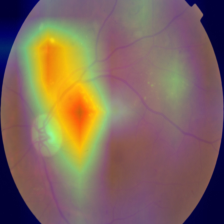
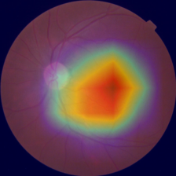
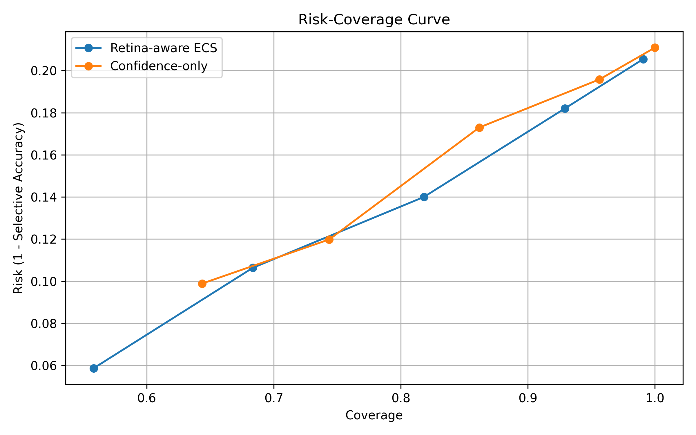
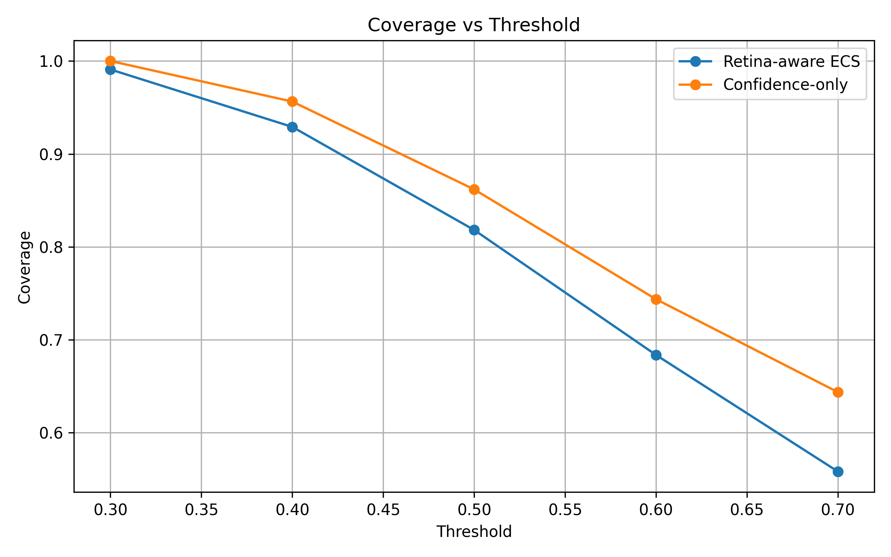

# 🩺 Retina-Aware Reliable DR Classification  
### Trustworthy AI for Diabetic Retinopathy Screening using Calibration, Explainability & Selective Prediction

<p align="center">


</p>

---

## 📌 Overview

Diabetic Retinopathy (DR) is one of the leading causes of blindness worldwide.  
Early diagnosis through retinal fundus screening can significantly reduce irreversible vision loss.

This project introduces a **Retina-Aware Reliability Framework** for DR classification that goes beyond raw accuracy by combining:

✅ Deep Learning Classification  
✅ Temperature Calibration  
✅ Grad-CAM Explainability  
✅ Retina Mask Anatomical Validation  
✅ Selective Prediction (Reject Uncertain Cases)  
✅ Trustworthy Medical AI Pipeline

---

## 🚀 Key Innovation

Traditional AI models may be:

❌ Overconfident when wrong  
❌ Looking at irrelevant regions  
❌ Unsafe for clinical deployment

We solve this using our proposed:

# 🔥 Explanation Consistency Score (ECS)

A reliability score combining:

- Confidence Score  
- Predictive Entropy  
- Grad-CAM Focus Quality  
- Retina Region Overlap  
- Calibration Confidence

Only reliable predictions are accepted.

---

## 🧠 Model Used

| Component | Choice |
|--------|--------|
| Backbone | EfficientNet-B0 |
| Framework | PyTorch |
| Calibration | Temperature Scaling |
| Explainability | Grad-CAM |
| Dataset | APTOS 2019 |
| Deployment | Streamlit |

---

## 📊 Performance Results

### Base Model

| Metric | Score |
|------|------|
| Accuracy | 78.91% |
| Macro F1 | 63.66% |
| QWK | 0.8798 |

### Ensemble Model

| Metric | Score |
|------|------|
| Accuracy | **81.64%** |
| Macro F1 | **67.52%** |
| QWK | **0.8929** |

### Reliability Gains

| Metric | Raw | Calibrated |
|------|------|------|
| ECE | 0.0635 | **0.0411** |
| NLL | 0.5849 | **0.5551** |

---

## 🩺 Selective Prediction Results

At ECS Threshold = 0.5

| Method | Coverage | Selective Accuracy |
|-------|----------|-------------------|
| Confidence Only | 86.18% | 82.70% |
| Retina-Aware ECS | **81.82%** | **86.00%** |

---

# 📷 Screenshots

## 🔥 Grad-CAM Heatmaps

> Add your screenshots inside `/assets/`

<p align="center">


</p>

---

## 📈 Reliability Curves

<p align="center">


</p>

---

## 🧪 Project Structure

```bash
retina-aware-reliable-dr-classification/
│── data/
│── outputs/
│── results/
│── scripts/
│── src/
│   ├── datasets/
│   ├── models/
│   ├── training/
│   ├── evaluation/
│   ├── explainability/
│── train.py
│── test.py
│── ensemble.py
│── test_ecs.py
│── app.py
│── requirements.txt
│── README.md
```
## ⚙️ Installation
```bash
⚙️ Installation
git clone https://github.com/MrigankJaiswal-hub/retina-aware-reliable-dr-classification.git

cd retina-aware-reliable-dr-classification

python3 -m venv venv
source venv/bin/activate

pip install -r requirements.txt
```

## 🚀 Train Model
```bash
python train.py \
--train_csv data/splits/train_split.csv \
--val_csv data/splits/val_split.csv \
--image_dir data/raw/train_images
```
## 🧪 Test Model
```bash
python test.py \
--test_csv data/splits/test_split.csv \
--image_dir data/raw/train_images \
--checkpoint outputs/aptos_exp1/best_model.pt
```

## 🔥 Run Ensemble
```bash
python ensemble.py
```
## 🧠 Run ECS Reliability Testing
```bash
python test_ecs.py \
--ecs_threshold 0.5
```

## 🌐 Streamlit Web App
```bash
streamlit run app.py
```
## 📚 Research Contributions
```bash
Proposed Novel Concepts

✅ Retina-Aware ECS
✅ Explainability Driven Trust Scoring
✅ Risk-Coverage Optimization
✅ Clinically Safer AI Decisions
```

## 🧑‍💻 Authors

Mrigank Jaiswal

B.Tech ECE, Central University of Jammu

### Co Authors

Pranav
Nanevarth Prakash

## Mentor

Dr. Sunil Datt Sharma
Associate Professor, DoECE
Central University of Jammu

## 📄 IEEE Research Paper

Included in repository:
```bash
paper/
``` 
Contains:

IEEE LaTeX Source
Figures
BibTeX References
Final PDF

## 🌟 Future Scope
Vision Transformer + CNN Hybrid
Multi-Dataset Validation
Real Hospital Deployment
Federated Medical Learning
Explainable Telemedicine AI


⭐ If You Like This Work

Please star this repository ⭐

📬 Contact

Mrigank Jaiswal
📧 contact.mrigankjaiswal@gmail.com

🔗 LinkedIn: www.linkedin.com/in/mrigank-jaiswal
🔗 GitHub: https://github.com/MrigankJaiswal-hub

## ⚖️ License
```bash
MIT License
```
🏆 Built for Top-Tier AI + Medical Research
Reliable AI is the future of healthcare.
